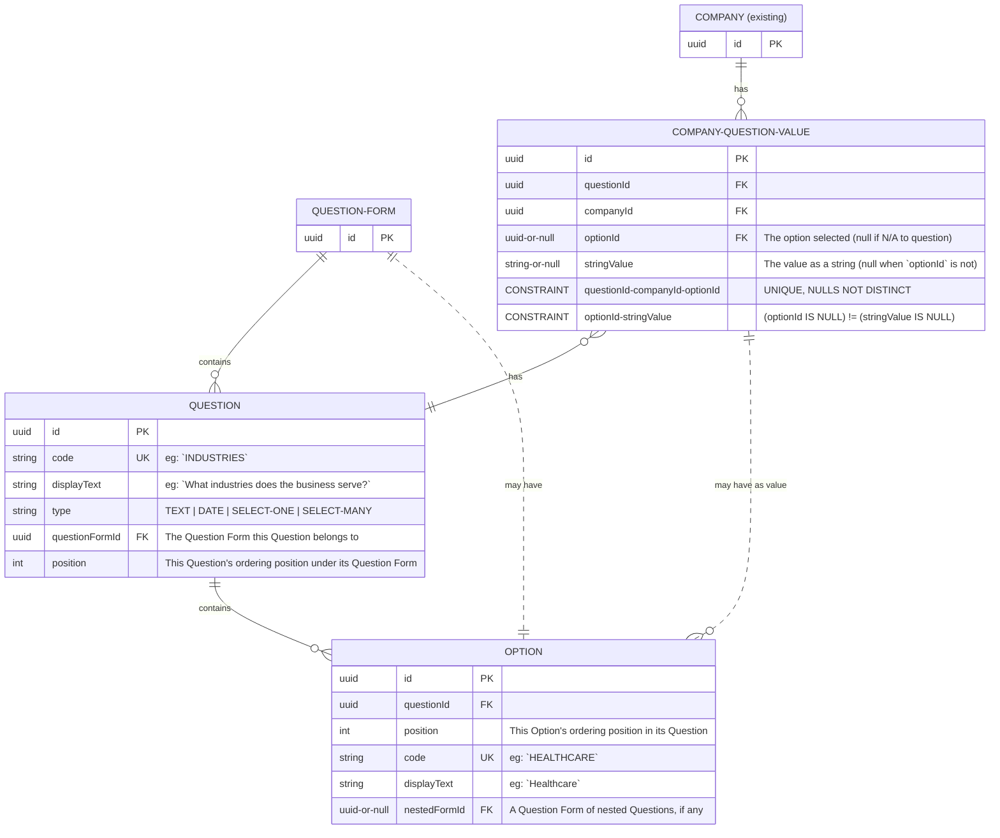

# Neo.Tax Question/Answer Data Model RFC

## Background

Neo.Tax provides an AI-based solution to calculate federal Research & Development tax credits from ticketing information, such as data from Jira or Linear. To do this correctly, we need a number of points of information from the customer before we even start dealing with the ticketing data. For instance:

- We need the company name, to use on emitted forms as well as to identify the company in the app UI.
- We need a few narrative descriptions of the company and its line of work to incorporate into the LLM prompts for better results.
- We need more technical corporate information, such as the date of incorporation, the fiscal year start, whether the company has recently a "short year" (when the fiscal year start changes, causing one "year" to be <12 months), and so on.

Some of this information will be used by the software for calculations, or to feed the LLM. Some information will only be used (today, at least) by a human CPA helping to onboard the customer and later to compile the final tax forms for them.

The answers come in a handful of types: text, dates, single selections, and multiple selections. Also, questions may be _nested_ under select answers—for instance, we want to ask if a customer has had a short year, and only if the answer is "Yes" should we ask _when_ that short year was.

Currently, we only collect some of this information. We collect it in scattered forms, and each value is its own column on the `companies` table. This makes it hard to keep track of all the questions, let alone the answers, and very expensive to add new questions.

The app uses PostgreSQL on the backend, GraphQL as the API, and React on the frontend.

## Goals

- Domain experts can get engineering to add new questions without it being a major task.

- A single Company Information page lists all of the questions in a single place, using consistent form controls for each answer type, and hiding and showing nested questions as appropriate, to make entering the data as simple as possible.

- The Company Information page has some controls at the top to make managing so many questions easier for the customer:

  - Show that N/M (X%) questions have been completed.
  - Filter to only Uncompleted or only Completed questions.
  - Filter by a simple string match with the question text.

- The answers to specific questions can be looked up by some well-known symbolic identifier. For instance, when the app has a reference to a company, it should be able to ask for its name. That's trivial when `name` is simply a column on `companies` as it is today, and should remain (relatively) trivial after this change.

- It would not be intractable to expand this system to additional, separate pages of questions, if we later want to have dfiferent information pages for different kinds of companies or product areas.

## Out of Scope

- Domain experts (non-engineers) don't need to be able to _edit_ the questions themselves, for now. It would be nice not to close off that possibility for the future, though.

## Proposal

The solution requires changes in three major areas:

- The database schema and server data model
- The GraphQL API
- The frontend presentation

### The Database Schema And Server Data Model

We begin with a new `QuestionForm` entity, which represents the root of a question form "schema". (There will be a well-known `QuestionForm` for the Company Information page.) This has many `Question`s, which have a `position` for ordering within the form. The `Question` has a unique `code` for reference, `displayText` for the screen, and one of a closed enum of `type`s: `TEXT | DATE | SELECT-ONE | SELECT-MANY`

If the `Question` is `SELECT-ONE | SELECT-MANY`, it has `Option`s for the customer to select. Like a `Question`, an `Option` has a `position`, `code`, and `displayText`. If we need to nest `Question`s under this answer (that is, show them when this `Option` is selected), the `nestedFormId` points to a `QuestionForm` which contains them recursively.

The response values are recorded as `CompanyQuestionValue`s. For a `TEXT | DATE` `Question`, `optionId` is null and `stringValue` contains the value. For a `SELECT-ONE | SELECT-MANY` `Question`, `stringValue` is null and `optionId` points to the selected value. Also, for a `SELECT-MANY` `Question`, there MAY be more than one `CompanyQuestionValue` for a `questionId`-`companyId` pair.

Note that dates are encoded as strings here for simplicity. We could also give `CompanyQuestionValue` another column to store the value when it's a date. We should decide whether it's worth the cost of another column to be able to reason about the dates within the database.

[](https://mermaid.live/edit#pako:eNqVVV1vmzAU_St3flkqhe490jShhKqoCbSFdJvGpLjBCZbAZtjuGpX8914IUEBNtUkI8PW5x-d-2H4hWxkzMiOsWHC6L2gWCYC7tROEru9ZV_79Cl4qE4AxPAZ8bm-q8TESfeT7IAClCy72UC0C6xuICNvPYON6i3UQ3rtOsInIABhzlaf0ELJn3YK_J1QDF7GpIExBLPGlEwaPRnHBlALFiif2bUylDzlDjtD5EUIJCzt08BM4S2ceWr7XG6xs72frW-v_Y5jSXIorWWRuDFeV7hAXvGvsUE2gBK7eTI8slWKPwmRLxYWGXCpeT1cEPfhnBbKIWa2zwxiBFuBaDRc68TX59m8_yvZAfa38vBQ_PyuEi4GKUV5Htbx27GV4PbfvnX-o5TWjqU62tGCbfsYtWVjCpClgOTWL-3m3R1mXuwbU2dUU-A6oOAwSNfdXt1jXXxFp_mDCnjk6iP1FRH73IB_2d4Oxuh3xYC_Xzv_mv7ZvZZajypG5C13mnVPTbicLdnfKtlXAkxqHsXpfbOyzbqGLYd47xtPwgaaGNYxP9T9VQNsanTj_JkzAplWwAWwPIXXHO_c93K2264W94KwuHquTHpG152KqpuCtl8sAPD-EhYuJ8-bhO2StnzVUOun43KAmuoBPX2HSB7UTg5IPT62ytCz58nZAzbAAQlMu1ODcamDNvhqCGmNZXl6W5Yh-hkIzeoCEPrGTijOtcpSW1fNGx4Sqfvs1Cs64j-Hj-UpcX_-bqqrOdcEjQqYkY0VGeYwnfd27EcETNMOpyiNmO2pSXYVxRCg1WgYHsSUzXRg2JYU0-4TMdjRVODJ5TDVrLovOymKuZbE63SX1lXJ8BUluD-I)

<!-- Source:

-->

### The GraphQL API

TK

The mutation `updateQuestionAnswer` is provided to write answers back.

#### GraphQL Schema

```graphql
### Reading

type Query {
  # ...
  # Existing:
  company(id: ID!): Company
}

# Existing:
type Company {
  id: ID!
  # ...existing fields...

  # Existing, but now looks up the answer to the question with code `COMPANY_NAME`:
  name: String!

  # New:
  # The list of Company Information questions, in presentation order.
  companyInformationQuestions: [Question!]!
}

interface Question {
  id: ID!
  displayName: String!
}

type TextQuestion implements Question {
  id: ID!
  displayName: String!
  stringValue: String
}

type DateQuestion implements Question {
  id: ID!
  displayName: String!
  dateValue: Date
}

interface SelectQuestion implements Question {
  id: ID!
  displayName: String!
  options: [Option!]!
}

type SelectOneQuestion implements Question {
  id: ID!
  displayName: String!
  options: [Option!]!
  selectedOption: Option!
}

type SelectManyQuestion implements Question {
  id: ID!
  displayName: String!
  options: [Option!]!
  selectedOptions: [Option!]!
}

type Option {
  id: ID!
  displayText: String!
  # The list of Company Information questions, in presentation order.
  nestedQuestions: [Question!]!
}

### Writing

# Up to one field should be provided, appropriate to the Question's type.
# Leaving the appropriate field null will clear the answer value.
input QuestionAnswer {
  stringValue: String
  dateValue: Date
  selectedOption: Option
  selectedOptions: [Option!]
}

type UpdateQuestionAnswerResponse {
  updatedQuestion: Question!
}

type Mutation {
  # ...
  # New:
  updateQuestionAnswer(
    questionId: ID!
    companyId: ID!
    response: QuestionAnswer!
  ): UpdateQuestionAnswerResponse!
}
```

#### Example Query

```graphql
fragment QuestionFragment on Question {
  __typename
  id
  displayName

  ... on TextQuestion {
    stringValue
  }

  ... on DateQuestion {
    dateValue
  }

  ... on SelectQuestion {
    options {
      id
      displayText
      nestedQuestions {
        ...QuestionFragment
      }
    }
  }

  ... on SelectOneQuestion {
    selectedOption {
      id
    }
  }

  ... on SelectManyQuestion {
    selectedOptions {
      id
    }
  }
}

query GetDataForCompanyInformationPage($companyId: ID!) {
  company(id: $companyId) {
    name
    companyInformationQuestions {
      ...QuestionFragment
    }
  }
}

mutation UpdateQuestionAnswer(questionId: ID!, companyId: ID!, answer: QuestionAnswer!) {
  updateQuestionAnswer(questionId: $questionId, companyId: $companyId, answer: $answer) {
    updatedQuestion: {
      ...QuestionFragment
    }
  }
}
```

### The Frontend Presentation

This RFC will only describe the frontend strategy, not visual details.

On load, the page will query for the question and answer data as described above. There will be a component for each of the four question types, and the questions will render as rows, top to bottom. A `Nested` component will let us render a list of questions below a parent when appropriate.

The frontend will need to understand a bit about the nesting logic to respond to the user's choices optimistically, before the mutation completes, showing and hiding any appropriate nested questions.

We already have the basic UI components to build these. The visual details will come from design later, and shouldn't impact complexity.

## Other Possibilities

### Present the Questions and Responses Separately in the API

In the proposed API, everything hangs off of a `Company`. One downside of this is that the `Question`s can't be cached between companies. Another is that we can't look up the shape of the Company Information page without a specific company in mind—though that's unlikely to come up.

We could expose the questions and options globally, and only put the the _responses_ under the company.

```graphql
type Query {
  # ...
  company(id: ID!): Company
  companyInformationQuestions: [Question!]!
}

type Company {
  id: ID!
  # ...
  companyInformationAnswers: [Answer!]!
}

type Answer {
  question: Question!
  # ...
}
```

However, this would mean we'd then have to cross-reference the questions and answers to reconstruct them on the client. It also make dealing with the polymorphism of various question types tricky, as you can see by attempting to fill out the `Answer` type.

The proposed method also means the frontend doesn't have to encode an assumption that every Company Information page has the same questions. If we change the set of questions for future customers, for instance, the frontend doesn't have to care.

There are also other ways to address the caching issue with a bit more complexity, but the data is minimal, and it's exceedingly rare to switch between companies during a session, so this shouldn't be an issue anyhow.

### Limit the Question Abstraction to the Frontend

We could define the Question schema purely in the frontend, and continue to use various fields to store the data in the backend. That would still allow us to change the list of questions easily, but would not make it easier to add new questions. It would also introduce a good deal of complexity in defining the mapping from each Question to a field in the API. (The inverse of this is the complexity under the proposed solution of looking up a particular value, such as a company's name).

### Serialize All Values to Strings

We could store all values, even select-one and select-multiple values, as strings in the database. This would make reasoning about the values in the datasbase harder (or impossible), but would simplify the DB schema a bit. Potentially, the entire Option entity could be removed. However, this is likely to simply replace complexity which models the domain well with different complexity that's harder to understand.
